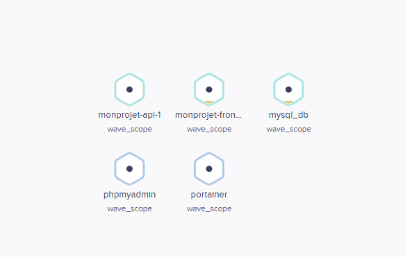
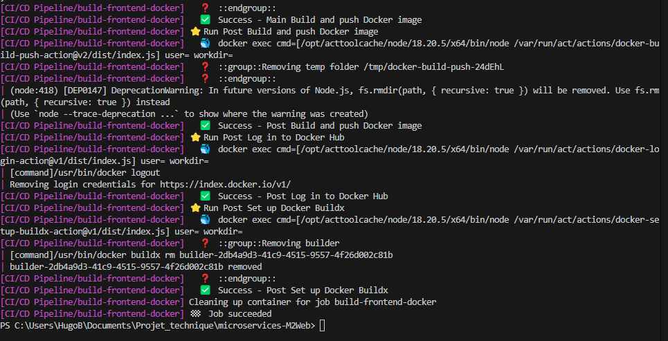

# MonProjet

[](https://github.com/Bagass0/microservices-M2Web/actions/workflows/ci-cd.yml)

## 📝 Description

Ce projet est une interface permettant de chercher des données d'écoles en France, couvrant la période de 2020 à 2024. Le projet utilise **React** pour le frontend et **PHP natif** pour le backend, avec une base de données **MySQL**. Ce projet est conteneurisé grâce à **Docker**, avec deux Dockerfiles et un fichier **docker-compose.yml** pour orchestrer les conteneurs.



## 🌟 Fonctionnalités principales

- **Frontend** : Créé en React, il propose une interface utilisateur moderne et réactive.
- **Backend** : Une API développée en PHP natif pour gérer les données.
- **Base de données** : MySQL est utilisé pour le stockage et la gestion des données.
- **Gestion des conteneurs** : 
  - Dockerfiles pour le frontend et le backend.
  - `docker-compose.yml` pour automatiser le déploiement des conteneurs.
- **Intégration et déploiement continus (CI/CD)** :
  - Utilisation de GitHub Actions pour automatiser les tests, la construction et le déploiement.

---

## 🐳 Conteneurisation avec Docker Compose

Le fichier `docker-compose.yml` orchestre les conteneurs nécessaires :

- **Frontend** : Conteneur pour l'application React.
- **Backend** : Conteneur pour l'API PHP.
- **MySQL** : Conteneur pour la base de données MySQL.
- **phpMyAdmin** : Outil de gestion de base de données.
- **Portainer** : Interface pour gérer les conteneurs.
- **Weave Scope** : Outil de visualisation des conteneurs.

### ⚙️ Commandes Docker utiles

- **Démarrer les conteneurs** :  
  ```bash
  docker-compose up -d
  ```
- **Arrêter les conteneurs** :  
  ```bash
  docker-compose down
  ```

### 🌐 Réseau et volumes

- Les services partagent un réseau nommé `education-network`.
- Les données MySQL et les configurations spécifiques sont stockées dans des volumes persistants.

---

## 🚀 Workflow CI/CD

Le workflow CI/CD pour ce projet est défini dans `.github/workflows/ci-cd.yml`. Il comprend les étapes suivantes :

1. **Tests du frontend** :  
   - Exécute les tests de l'application React.
   - Utilise Node.js 14 pour l'environnement d'exécution.
   
2. **Construction et publication des images Docker** :  
   - Les images Docker pour le frontend et le backend sont construites et poussées vers Docker Hub.
   
3. **Déploiement** :  
   - Déploiement automatique des conteneurs sur un serveur à l'aide de Cloudron .

### 🔍 Étapes détaillées

#### ✅ Tests du frontend

- Vérifie la qualité du code et des fonctionnalités avec des tests.
- Nécessite que les tests soient configurés dans le projet React.

#### 🏗️ Construction des images Docker

- Chaque service (frontend, backend) a son propre Dockerfile.
- Les images sont taguées avec `latest` et poussées sur Docker Hub.

#### 🌐 Déploiement

- Déploie automatiquement les conteneurs sur un serveur distant avec Coolify.
- Les images sont déployées avec les ports :
  - Backend : `5000:5000`
  - Frontend : `3000:3000`

---

## 🔧 Tester le Workflow CI/CD localement avec `act`

Pour tester localement le workflow CI/CD sans avoir besoin de pousser des changements sur GitHub, nous utilisons **act**.

### Qu'est-ce que `act` ?

`act` est un outil qui permet d'exécuter des workflows GitHub Actions sur votre machine locale. Il simule l'environnement GitHub Actions en utilisant Docker, ce qui est pratique pour tester les workflows avant de les pousser dans un dépôt.

### Installation d'act

1. Téléchargez et installez `act` depuis son [dépôt GitHub](https://github.com/Bagass0/microservices-M2Web).
2. Ajoutez-le à votre PATH pour qu'il soit accessible globalement.

### Commandes utiles

- Exécuter tout le workflow :  
  ```bash
  act
  ```

- Exécuter un job spécifique (exemple : `test-frontend`) :  
  ```bash
  act -j test-frontend
  ```



---

## 🛠️ Architecture du projet

```
.github/workflows            # Configuration Docker Compose
    └── ci-cd.yml
MonProjet/
├── projet-devops/           # Code du frontend (React)
│   ├── .dockerfile          # Dockerfile pour le frontend
│   └── ...                 # Autres fichiers React
├── DEVOPS-API/              # Code du backend (PHP)
│   ├── .dockerfile          # Dockerfile pour le backend
│   └── ...                 # Autres fichiers PHP
├── docker-compose.yml       # Configuration Docker Compose
```

---

## 📋 Prérequis

- **Docker** : Version 20.10+.
- **Docker Compose** : Version 1.29+.
- **Node.js** : Version 14 pour le frontend.
- **MySQL** : Version 8.0+ pour la base de données.

---

   Accédez aux services :
   - Frontend : [http://localhost:3000](http://localhost:3000)
   - phpMyAdmin : [http://localhost:8080](http://localhost:8080)
   - Portainer : [http://localhost:9000](http://localhost:9000)
   - Weave Scope : [http://localhost:4040](http://localhost:4040)

---
